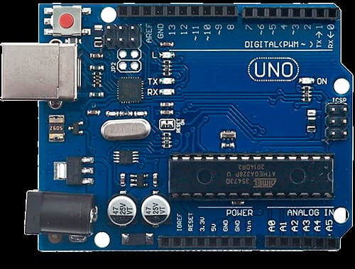
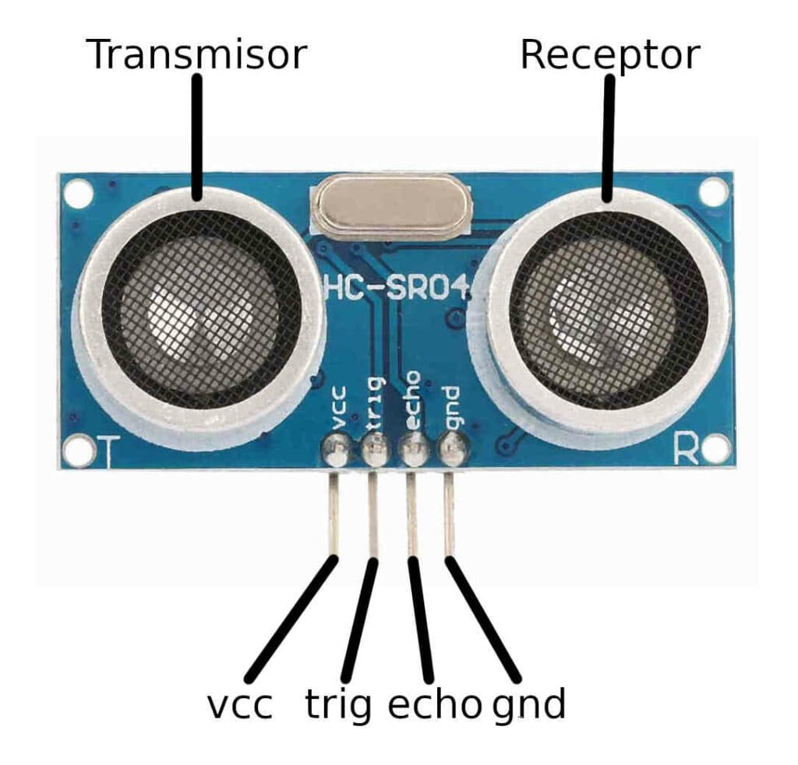
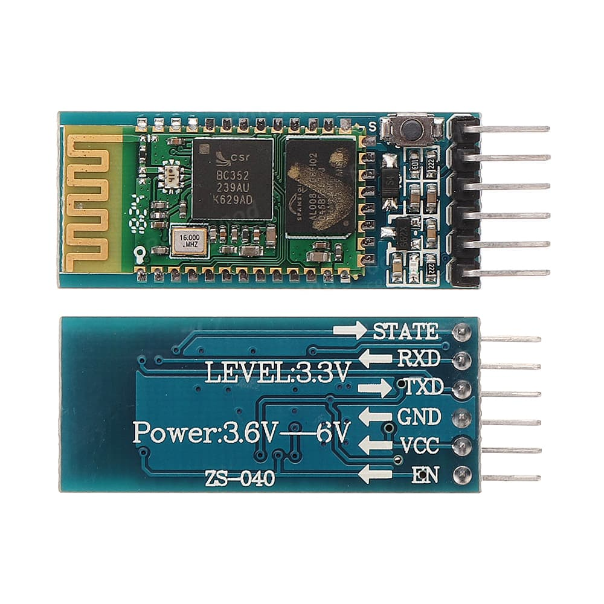
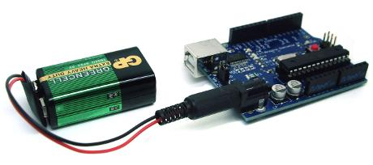
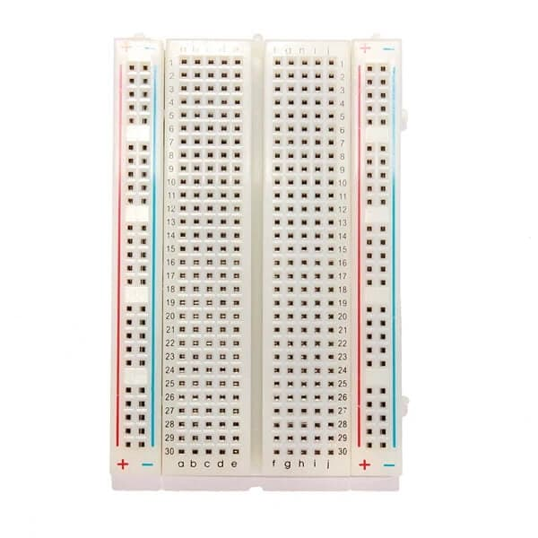
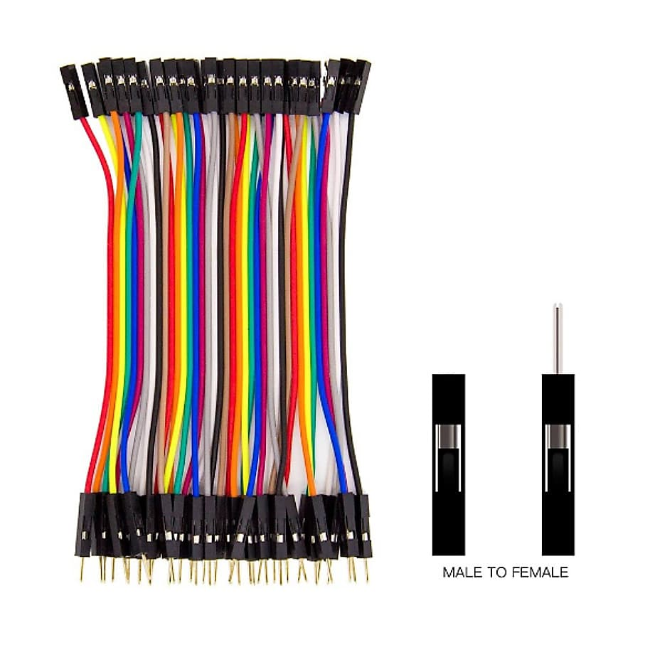

# EcoVision

EcoVision is a Flutter application for object detection using the device camera, on-screen overlays, and voice interaction.

## Features

- Real-time object detection with camera preview.
- Voice control using STT and TTS.
- Commands like `buscar [objeto]`, `buscar todo`, and `instrucciones`.
- Persistent onboarding that is played only once and includes a `Repetir instrucciones` button.
- Bluetooth support for distance/sensor data.
- Full-screen settings panel and accessibility labels for TalkBack and VoiceOver.
- Custom app icon and branded UI.

## Supported Objects & Model Upgrade

EcoVision started as a prototype targeting 4 specific home navigation objects (`cama`, `grada`, `mesa`, `puerta`). It has now been upgraded to use the **YOLOv8** model trained on the **COCO 2017 Dataset**, supporting **80 different classes** of real-world objects.

### Dataset Credit
Special thanks and credit go to the creators of the [COCO Dataset](https://cocodataset.org/) (Microsoft COCO: Common Objects in Context), which makes robust, open-source object detection possible.

The 80 supported classes are organized into 8 logical categories inside the app settings (fully translated and optimized for Spanish voice search and text-to-speech feedback):
- **Kitchen (Cocina)**: botella (bottle), copa de vino (wine glass), taza (cup), tenedor (fork), cuchillo (knife), cuchara (spoon), tazón (bowl), microondas (microwave), horno (oven), tostadora (toaster), fregadero (sink), refrigerador (refrigerator).
- **Home & Furniture (Hogar y Muebles)**: silla (chair), sofá (couch), planta en maceta (potted plant), cama (bed), mesa de comedor (dining table), inodoro (toilet), televisor (tv), florero (vase), reloj (clock).
- **People & Vehicles (Gente y Vehículos)**: persona (person), bicicleta (bicycle), auto (car), motocicleta (motorcycle), avión (airplane), autobús (bus), tren (train), camión (truck), barco (boat).
- **Devices & Personal Items (Dispositivos y Uso Personal)**: mochila (backpack), paraguas (umbrella), bolso (handbag), corbata (tie), maleta (suitcase), laptop, mouse, control remoto (remote control), teclado (keyboard), celular (cell phone), libro (book), tijeras (scissors), secador de pelo (hair drier), cepillo de dientes (toothbrush).
- **Animals & Pets (Animales y Mascotas)**: pájaro (bird), gato (cat), perro (dog), caballo (horse), oveja (sheep), vaca (vaca), elefante (elephant), oso (bear), cebra (zebra), jirafa (giraffe), oso de peluche (teddy bear).
- **Sports & Entertainment (Deportes y Entretenimiento)**: frisbee, esquís (skis), tabla de snowboard, pelota deportiva (sports ball), cometa (kite), bate de béisbol (baseball bat), guante de béisbol (baseball glove), patineta (skateboard), tabla de surf (surfboard), raqueta de tenis (tennis racket).
- **Food (Comida y Alimentos)**: plátano (banana), manzana (apple), sándwich, naranja (orange), brócoli (broccoli), zanahoria (carrot), hot dog, pizza, dona (donut), pastel (cake).
- **Public Way & Signals (Vía Pública y Señales)**: semáforo (traffic light), hidrante (fire hydrant), señal de pare (stop sign), parquímetro (parking meter), banco (bench).

> [!NOTE]
> Although the YOLOv8 model uses English classes natively, EcoVision translates these labels in real time. Users can use Spanish voice commands (e.g., `buscar cuchara`, `buscar celular`) and the system handles plural variations dynamically (`cucharas`, `celulares`) using a custom Spanish pluralization algorithm.

For voice search, if you request an object that is not part of the 80 COCO classes, the app will announce `Objeto aun no incluido`.

## Requirements

- Flutter SDK
- Android Studio, Xcode, or VS Code with Flutter support
- Android or iOS device for camera, speech, and Bluetooth features

## Permissions used by the app

EcoVision requests these permissions at startup:

- Camera: required for object detection and preview.
- Location: required by Bluetooth behavior on some Android devices and for device discovery compatibility.
- Bluetooth / Nearby devices: required to search for and connect to the external Bluetooth device used by the app.
- Microphone: required for voice commands through speech recognition.

## First launch

When the app is opened for the first time, EcoVision plays a short spoken introduction. If you want to hear it again, use the `Repetir instrucciones` button on the onboarding screen before entering the camera.

## Setup

Install dependencies:

```bash
flutter pub get
```

## Run

Run on a connected device:

```bash
flutter run
```

## Useful commands

- `buscar [objeto]`: filter announcements to a specific object.
- `buscar todo`: show and announce all supported objects.
- `instrucciones`: hear the help message.
- `Repetir instrucciones`: replay the first-run onboarding message.

## Project structure

- `lib/main.dart`: main app logic, camera, voice control, and settings.
- `assets/`: logo, labels, and TFLite model.
- `test/widget_test.dart`: basic widget test.

## Notes

- Do not commit generated folders such as `build/` or `.dart_tool/`.
- Platform build artifacts and ephemeral files are ignored through `.gitignore`.

## Hardware Assembly & Connection Guide

EcoVision connects to an external hardware setup composed of an Arduino UNO, an HC-05 Bluetooth module, and an ultrasonic distance sensor to measure distances to front obstacles and speak them in real time.

### 📋 Components List

1. **Microcontroller**: Arduino Uno.
   <br/><br/><br/>
2. **Distance Sensor**: HC-SR04 Ultrasonic sensor.
   <br/><br/><br/>
3. **Wireless Module**: HC-05 (or HC-06) Bluetooth Serial Pass-Through module.
   <br/><br/><br/>
4. **Power Supply**: 9V Battery with a DC jack connector (for portable usage).
   <br/><br/><br/>
5. **Prototyping Board**: Breadboard/Protoboard.
   <br/><br/><br/>
6. **Wires**: Jumper wires (Male-to-Male and Male-to-Female).
   <br/>

### 🔌 Circuit Wiring

#### 1. Power Distribution (5V) using the Breadboard

- Connect a wire from the Arduino **`5V`** pin to the **positive rail (`+` red line)** of the breadboard.
- Connect the **`VCC`** pin of the HC-05 module to the positive rail `+` of the breadboard.
- Connect the **`VCC`** pin of the HC-SR04 Ultrasonic sensor to the positive rail `+` of the breadboard.
  _(Note: Both modules receive power from the single Arduino 5V pin via the breadboard positive rail)._

#### 2. Ground (GND) Connections Direct to Arduino

- Connect the **`GND`** pin of the HC-05 module directly to one of the **`GND`** pins of the Arduino.
- Connect the **`GND`** pin of the HC-SR04 Ultrasonic sensor directly to another available **`GND`** pin of the Arduino.

#### 3. Data Pins Connections

- **Bluetooth HC-05 module**:
    - Connect the **`TXD`** pin to Arduino digital Pin **`2`** (SoftwareSerial RX).
    - Connect the **`RXD`** pin to Arduino digital Pin **`3`** (SoftwareSerial TX).
- **Ultrasonic HC-SR04 sensor**:
    - Connect the **`Trig`** pin to Arduino digital Pin **`5`**.
    - Connect the **`Echo`** pin to Arduino digital Pin **`6`**.

#### 4. Portability & Mounting

- Connect the 9V battery plug to the DC barrel jack of the Arduino.
- Place the circuit (except the face of the ultrasonic sensor) inside a protective enclosure.
- Mount the sensor on the **top of your smartphone** (e.g., using a phone-case clip or strap), pointing forward in the same direction as the phone's back camera.

### 💻 Arduino Sketch

Upload this code to your Arduino board using the Arduino IDE:

```cpp
#include <SoftwareSerial.h>
#include <Ultrasonic.h>

// Define ultrasonic sensor pins (Trig, Echo)
Ultrasonic sensor(5, 6);

// Define SoftwareSerial pins (Arduino RX, Arduino TX)
SoftwareSerial bt(2, 3); // Pin 2 to HC-05 TXD, Pin 3 to HC-05 RXD

void setup() {
  Serial.begin(9600); // Hardware serial console for debugging
  bt.begin(9600);     // HC-05 Bluetooth module communication

  Serial.println("Setup complete. Starting measurements...");
  bt.println("Setup complete. Starting measurements...");
}

void loop() {
  int distance = sensor.read(); // Read distance in cm

  // Filter valid readings within range (up to 3.5 meters)
  if (distance > 0 && distance < 350) {
    bt.println(distance); // Send distance to the mobile app
    Serial.println("Distance: " + String(distance) + " cm"); // Debugging
  } else {
    Serial.println("Distance out of range");
  }

  delay(200); // Interval between readings
}
```

### 📚 Arduino Libraries

- **`SoftwareSerial.h`**: Built-in library. No extra installation required.
- **`Ultrasonic.h`**: Search and install `"Ultrasonic"` by **Erick Simões** using the Library Manager (_Tools > Manage Libraries..._) in the Arduino IDE.
